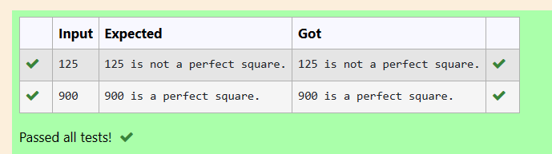

# EX2(B)Nested Loops
Developed by: ARSHITHA MS

Register number: 212223240015
 ## AIM:
 To write a program to generate Fibonacci sequence of n numbers and to check whether the given number is a perfect square or not using functions.

 ## ALGORITHM:
 1.Start the program

 2.Declare the variables

 3.Get input from the user.

 4.Use for loop for fibonacci sequence anf if-else to find if a number is perfect square.
 
 5.Print the output.

 6.End the program

 
 ## PROGRAM
 ### Program 1:
 ```
#include <stdio.h>
int fib()
{
    int a,b,n,fib,i;
    a=0;
    b=1;
    scanf("%d",&n);
    printf("%d %d ",a,b);
    for (i=0;i<=(n-3);i++)
    {
        fib=a+b;
        printf("%d ",fib);
        a=b;
        b=fib;
    }
    return 0;
}
int main()
{
    fib();
    return 0;
}
```
### Program 2:
```
#include <stdio.h>
#include <math.h>
void sq(int a)
{
    int s;
    s=sqrt(a);
    if(pow(s,2)==a)
    {
        printf("%d is a perfect square.",a);
    }
    else
    printf("%d is not a perfect square.",a);
}
int main()
{
    int n;
    scanf("%d",&n);
    sq(n);
}
```

## OUTPUT:
### Output 1:


### Output 2:


## RESULT:
Thus the program to print the Fibonacci sequence of n numbers and to check whether the given number is a perfect square or not using functions is executed successfully.